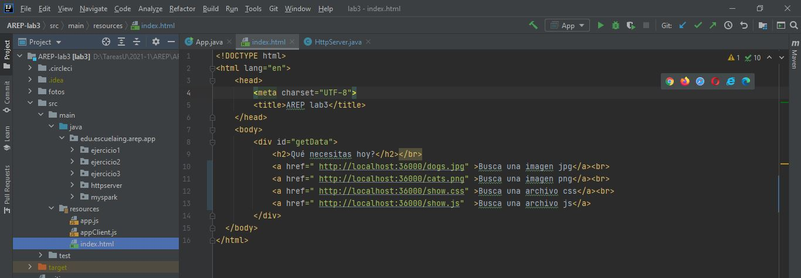
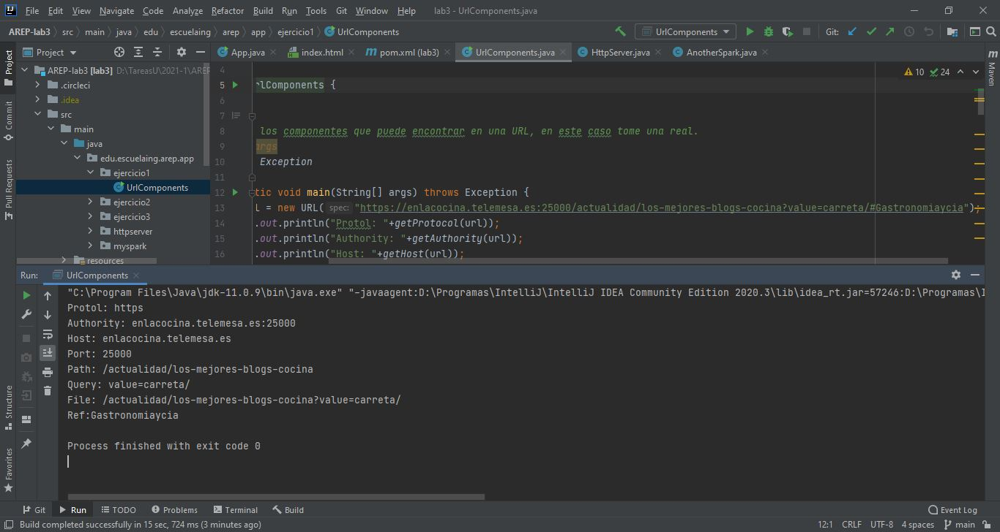
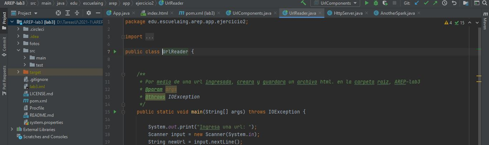
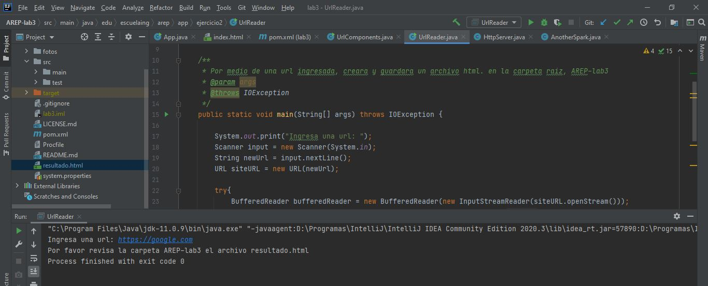
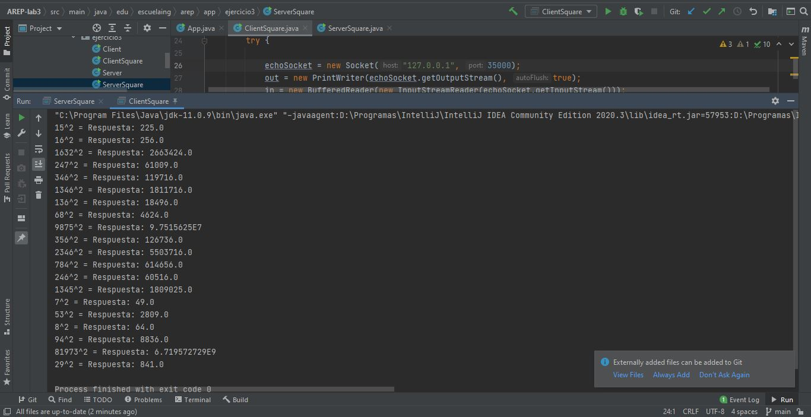
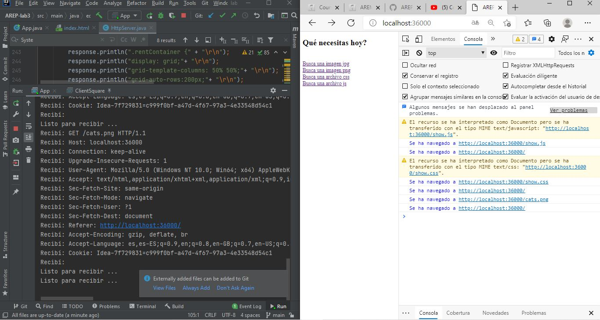
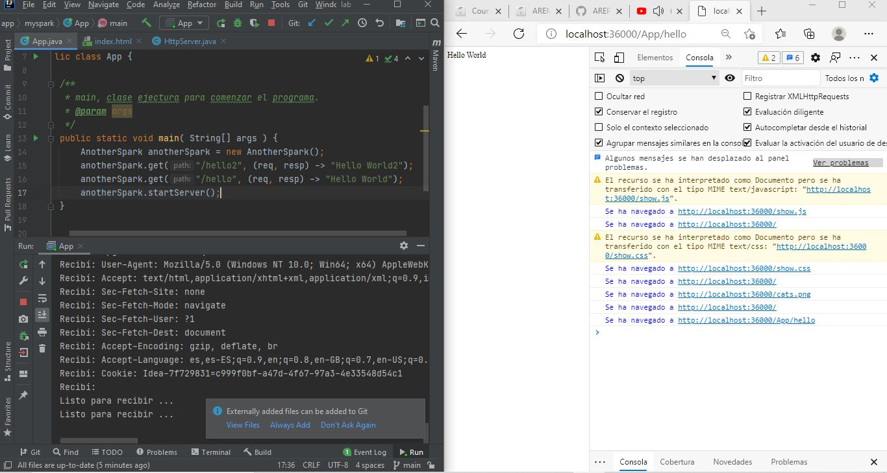

## _Despliegue en Heroku_ 
[](https://aqueous-plains-80854.herokuapp.com/)

 ## _Integración continua_ 
[](https://app.circleci.com/pipelines/github/sebastianNietoMolina/AREP-lab3)

## _Calidad del código_ 
[](https://www.codacy.com/gh/sebastianNietoMolina/AREP-lab3/dashboard?utm_source=github.com&amp;utm_medium=referral&amp;utm_content=sebastianNietoMolina/AREP-lab3&amp;utm_campaign=Badge_Grade)

# TALLER CLIENTES Y SERVICIOS

Este proyecto busca implementar un framwork parecido a Spark, al igual que Spark debe leer la petición get con parámetros una función lambda. Su alcance es explorar la arquitectura de sistemas distribuidos en la red, tiene como objetivo construir un modelo cliente servidor para hacer peticiones http, se debe poder desplegar en heroku, y adicional debe estar conectado a una base de datos y, se debe poder hacer peticiones ahí también, tambien puede consulta mas sobre su implementacion en el pdf.

NOTA: Esta hecha toda la implementación propuesta menos la de la base de datos. 

## Comenzando 🚀

_Estas instrucciones te permitirán obtener una copia del proyecto en funcionamiento en tu máquina local para propósitos de desarrollo y pruebas._

### Pre-requisitos 📋

Para poder hacer uso de este proyecto se debe tener instalado:
 
  * MVN
  * Git
  * Java 11
  * HerokuCli (En caso de querer desplegar el proyecto localmente)

### Instalación 🔧

Lo primero que debe hacer es descargar el proyecto, lo pude hacer directamente descargando el .zip, o puede clonar el archivo con el siguiente comando.

```
git clone https://github.com/sebastianNietoMolina/AREP-lab3.git
```

Entramos al directorio del proyecto con el comando

```
cd AREP-lab3
```

Luego debe ingresar el siguiente comando para que se ejectue hasta la fase de empaquetamiento, debe asegurar que antes de ingresar este comando, que exista en la carpeta que esta un archivo llamado pom.xml

```
mvn clean install package
```

Tambien me gustaria aclarar que puedes descargar el javaDoc, este quedara guardado en una carpeta target, esta se genera una vez echo el comando anterior, y con el siguiente comando se creara la carpeta site, la ruta sera target/site.

```
mvn javadoc:javadoc
```

Si desea correr heroku localmente, hay un archivo que se llama Procfile, si su sistema operativo es Linux, use el siguiente comando.

```
web: java $JAVA_OPTS -cp target/classes edu.escuelaing.arep.app.myspark.App
```

Si falla agrega lo siguiente

```
web: java $JAVA_OPTS -cp "target/classes" edu.escuelaing.arep.app.myspark.App
```
Si usa windows use el siguiente.

```
web: java -cp target/classes edu.escuelaing.arep.app.myspark.App
```

Recuerde que para ver heroku localmente debe ingresar el siguiente comando en cmd 

```
heroku local web
```
Posteriormente debe escribir el siguiente link en su buscador: localhost:5000

Si por el contrario solo ejecuto el programa desde el main, o por comando, debe escribir el siguiente link en su buscador: localhost:36000

Recuerda que debes hacer el siguiente cambio en el archivo index.html, para que pueda funcionar correctamente el programa, te dejare un ejemplo de como se veen localhost.



## Ejercicio 1

Para este caso debes ir a la carpeta ejercicio1, ahí encontraras los métodos get para tener todas las partes de una url, en particular esta url tiene secciones que no le pertenecen, que fueron agregadas apropósito para que pudieran salir todas las impresiones en consola.



## Ejercicio 2

Aquí simplemente se hace  una lectura con ayuda del bufferReader y luego todas las líneas que encontró el archivo las guardamos en uno nuevo, por consola te pedirá que ingreses la url, y esta se guardara en la carpeta que esta al mismo nivel de la carpeta src, con el nombre resultado.html




## Ejercicio 3

En este ejercicio, se plantea 2 soluciones, en particular, se tiene un cliente y un servidor, se debe correr primero el servidor y luego el cliente, ahí, el cliente ingresa cualquier cadena de texto y el servidor retornara lo que el cliente escribió, pero, el reto era leer 20 números y elevarlos al cuadrado, para ello, se usa la misma lógica, hay un cliente y servidor, pero estos en particular elevan el numero al cuadrado, y lee un arreglo ya definido, luego de elevar los números al cuadrado se cierra el cliente y servidor.



## Reto1

En particular se creó un index.html que lo que hace es pedir al servidor web que traiga algunas rutas que el ya tiene guardadas, como lo son, un archivo .css que te mostrara en pantalla que contiene (para el caso que se desplego en heroku este archivo deje de encontrarlo,), un archivo .js que al igual que el .css, te mostrara su contenido, y 2 imágenes, una .png y otra .jpg, aquí el reto se genera porque debemos crear nuestro propio http serve, si desea detallar mas puede ver el documento .pdf que lo describe un poco mejor.



## Reto 2

Para este último reto se debía crear el framework como tal que leyera peticiones get con funciones lambda, y además pudiera conectarse a una base de datos y guardar y mostrar información de ahí, en particular este ultimo caso no se pudo lograr, pero se pudo implementar una función que nos permitiera leer peticiones get, y además estar desplegado en heroku.

Para esste caso tenemos dos casos hello y hello2, es muy importante que completen la ruta con /App/hello o /App/hello2 como se ve en el siguiente link, eso cuanto abran heroku.

```
https://aqueous-plains-80854.herokuapp.com/App/hello
```



## Autores ✒️

_Menciona a todos aquellos que ayudaron a levantar el proyecto desde sus inicios_

* **Sebastian Nieto** - [sebastianNieto](https://github.com/sebastianNietoMolina)

## Licencia 📄

Este proyecto está bajo la Licencia MIT - mira el archivo [LICENSE.md](LICENSE.md) para detalles

## Expresiones de Gratitud 🎁

Reconocimientos a: [Villanuevand](https://github.com/Villanuevand), use su plantilla de README.md.
